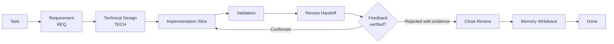

# AI Collaboration Workflow Template

A reusable documentation template for long-running software projects built with AI coding agents.

This repository packages a practical AI collaboration workflow. It gives agents a durable project memory, explicit requirement and design gates, evidence-based review handoffs, and a place to write back lessons after each slice of work.

## Quick Start

1. Click **Use this template** on GitHub, or copy `AGENTS.md`, `CLAUDE.md`, and `zettelkasten/` into an existing repository.
2. Ask your AI coding assistant:

   ```text
   Initialize this knowledge base by following INIT.md.
   ```

3. Start non-trivial work with the loop: `REQ -> TECH -> implementation -> validation -> REVIEW -> writeback`.



## What It Solves

AI coding agents are strong at local implementation but weak at long-lived project continuity unless the project gives them structure. This template turns project documentation into a lightweight operating workflow:

- **Context pack**: agents read the smallest necessary context instead of re-discovering the whole repo.
- **Requirement workflow**: every non-trivial change has scope, acceptance criteria, and known non-goals.
- **Technical design gate**: code work waits for an approved design unless the task is explicitly a tiny low-risk fix.
- **Review handoff**: review feedback is treated as a hypothesis that needs evidence and independent verification.
- **Validation discipline**: build, test, browser, integration, and realistic-environment checks are recorded where future agents can find them.
- **Memory writeback**: architecture changes, test procedures, and gotchas are written back into the knowledge base.

The default template is intentionally plain: no specialized process jargon, no heavy role system, and no requirement to run multiple agents.

## Zettelkasten Inspiration

This template is inspired by the Zettelkasten note-taking method: small notes, explicit links, and knowledge that grows through connections instead of one large document. In this project, that idea is adapted for AI coding agents: requirements, technical designs, review handoffs, architecture notes, validation runbooks, and gotchas are separate notes that link to each other.

The goal is practical retrieval. A future agent should be able to start from a task, follow links to the minimum context, do the work, and write back what changed.

## Language

The template is English-first. Keeping the canonical version in one language reduces drift and makes the project easier to reuse globally. Translations can be added later as guides under `docs/zh-CN/` without duplicating the full template.

Chinese guide: [docs/zh-CN/README.md](docs/zh-CN/README.md).

## Structure

```text
.
├── AGENTS.md                  # Generic agent rules for an initialized project
├── CLAUDE.md                  # Claude Code adapter that points back to AGENTS.md
├── INIT.md                    # AI-run initialization checklist
└── zettelkasten/
    ├── AI.md                  # Vendor-neutral AI-facing knowledge base entry point
    ├── {{PROJECT_NAME}}.md    # Project index, renamed during init
    ├── 00-governance/         # AI workflow, validation, decisions, gotchas, templates
    ├── 01-overview/           # Quick reference and product vision
    ├── 02-architecture/       # Current architecture notes
    ├── 03-roadmap/            # Phases and release planning
    ├── 04-cross-cutting/      # Umbrella/cross-module concerns
    ├── 05-reference/          # External-doc summaries and runbooks
    ├── 06-requirements/       # Workflow: backlog -> in-progress -> done
    ├── 07-review/             # Workflow: pending -> in-review -> done
    └── 08-technical-designs/  # Workflow: pending -> approved -> implemented
```

## Use As A Template

1. Create a new repository from this template, or copy `AGENTS.md`, `CLAUDE.md`, and `zettelkasten/` into an existing project.
2. In your AI coding tool, say:

   ```text
   Initialize this knowledge base by following INIT.md.
   ```

3. Answer the initialization questions.
4. Let the agent replace placeholders, prune single-repo or umbrella-only sections, create the first notes, remove `INIT.md`, and commit the initialized knowledge base.

## Daily Workflow

For non-trivial work, agents should follow this loop:

1. Read `AGENTS.md`, `zettelkasten/AI.md`, and `zettelkasten/00-governance/ai-workflow.md`.
2. Find or create the relevant requirement under `zettelkasten/06-requirements/`.
3. Confirm the linked technical design is approved under `zettelkasten/08-technical-designs/`.
4. Implement only the current slice and run the smallest meaningful validation.
5. Create or update a review handoff under `zettelkasten/07-review/`.
6. Handle reviewer feedback with evidence, then write durable lessons back to `00-governance/gotchas.md`, `02-architecture/`, or `05-reference/`.

See `examples/example-saas/` for a fictional end-to-end walkthrough.

## Naming Rules

- Requirements: `REQ-YYYYMMDDHHMMSS-short-name.md`
- Technical designs: `TECH-YYYYMMDDHHMMSS-short-name.md`
- Review handoffs: `REVIEW-YYYYMMDDHHMMSS-short-name.md`

## What To Customize

Start with these files after initialization:

- `AGENTS.md`: repo-specific AI rules, build commands, test discipline, branch policy.
- `zettelkasten/00-governance/project-overview.md`: project purpose, stack, constraints.
- `zettelkasten/01-overview/quick-reference.md`: commands, URLs, ports, test accounts, runbooks.
- `zettelkasten/02-architecture/current-architecture-flow.md`: current system flow.
- `zettelkasten/05-reference/e2e-test.md`: project-specific validation commands.

## License

MIT. Use it, fork it, and adapt it to your own AI engineering workflow.
