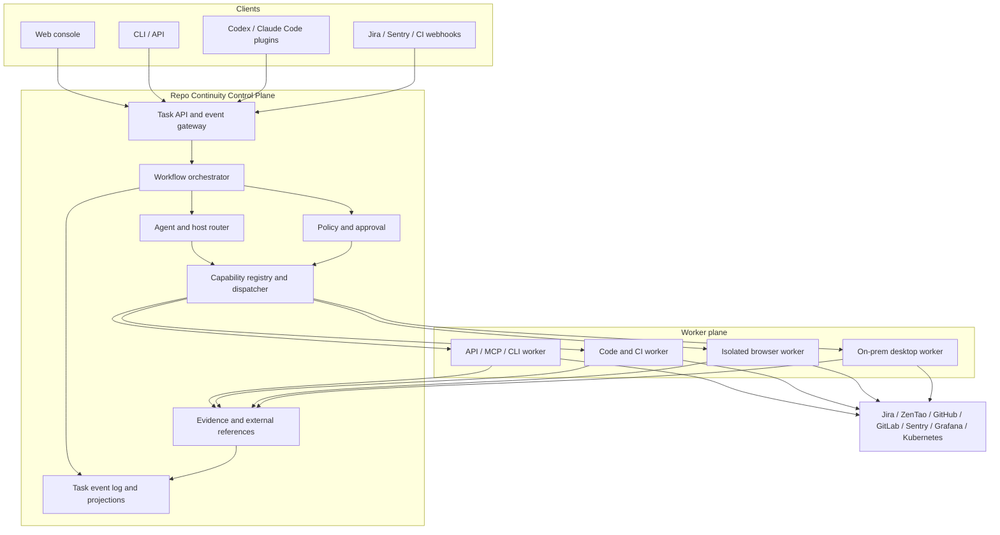

# Repo Continuity Control Plane Architecture

**Status:** Accepted product direction; runtime not yet implemented

**Last updated:** 2026-08-08

**Scope:** Optional orchestration and integration layer outside the default `template/` payload

## Decision Summary

Repo Continuity will evolve as two independently usable layers:

1. **Repo Continuity Core** remains the repository-owned Markdown and Git knowledge layer plus its lightweight delivery contract. It stays usable without a service, database, scheduler, hidden memory, or autonomous runtime.
2. **Repo Continuity Control Plane** is an optional future runtime for cross-platform task state, deterministic workflow, policy, approval, audit, and worker dispatch.

Codex, Claude Code, other coding agents, a first-party web agent, and automation clients are interchangeable hosts or clients around that control plane. None of them becomes the sole owner of durable project truth. Workers expose bounded capabilities for issue trackers, source hosts, observability systems, CI/CD, Kubernetes, browsers, and desktops.

The target architecture is **hybrid**:

- the control plane owns the long-lived task lifecycle and the next allowed workflow transition;
- a host or first-party agent owns bounded reasoning inside one leased step;
- workers execute validated action requests but do not decide the broader workflow;
- humans approve high-impact actions at the point of risk;
- repository knowledge and tracked or governed WORK records remain reviewable in Git.

This design does not claim that the control-plane runtime or its connectors already exist.

## Why This Is A Separate Layer

Software delivery crosses systems with different trust, identity, and execution boundaries:

- Jira or ZenTao may own requirements and defects;
- GitHub or GitLab may own code review and CI state;
- Sentry and Grafana may own diagnostic evidence;
- a CI/CD or GitOps system may own deployments;
- Kubernetes may expose runtime health;
- a private or legacy installation may be reachable only through an internal browser or desktop.

A coding-agent conversation can coordinate one bounded task, but it is a poor authority for an organization-wide, long-running workflow. Sessions end, hosts change, tool catalogs differ, and a model-generated decision is not an authorization decision. The control plane exists to preserve state and enforce the parts of delivery that must remain deterministic across those boundaries.

## Product Boundaries

### Core, available today

Repo Continuity Core owns:

- repository instructions and linked project knowledge;
- Direct, Tracked, and Governed routing;
- one stable WORK record for tracked or governed work;
- checkpoints, decisions, risks, validation evidence, and next action;
- durable experience promotion;
- Git isolation and resumable handoff semantics.

Core does not require the control plane. Installing, removing, or replacing a control-plane implementation must not make repository knowledge unreadable or invalidate the core workflow.

### Optional control plane, design direction

The control plane owns:

- externally initiated task identity and correlation;
- durable workflow state, retries, timeouts, pause, resume, and compensation;
- capability discovery and dispatch;
- policy evaluation and action-time approval;
- identity references and execution-location selection;
- audit events and external evidence references;
- switching between compatible hosts and workers without losing task state.

It links to lifecycle-owning systems rather than copying them. Jira, ZenTao, GitHub, GitLab, CI/CD, and release systems remain authoritative for their native objects.

### Non-goals

The combined product does not aim to:

- replace issue trackers, source hosts, CI/CD, observability platforms, or Kubernetes;
- put every delivery decision under unconstrained model autonomy;
- require browser or desktop automation when a stable API or CLI exists;
- make Codex, Claude Code, or any model provider a mandatory dependency of Core;
- synchronize a developer's unrestricted daily browser profile into a cloud worker;
- store credentials, tokens, or secrets in WORK records, prompts, action logs, or evidence payloads;
- duplicate an external system's complete lifecycle in repository workflow files.

## Terminology

| Term | Responsibility |
|---|---|
| Model | Produces reasoning, structured proposals, or tool calls. It is not an authority by itself. |
| Agent runtime | Runs a model/tool loop, builds context, evaluates results, and decides the next action within its assigned boundary. |
| Host agent | Codex, Claude Code, another CLI agent, or a first-party agent session that performs bounded reasoning and tool use. |
| Client | Web UI, CLI, plugin, chat integration, webhook, or API caller that creates or observes tasks. |
| Skill | Reusable instructions and domain workflow guidance loaded by a host. A Skill is not an independent runtime. |
| Control plane / Hub | Owns long-lived task state, workflow transitions, policy, approval, dispatch, and audit. |
| Workflow | Deterministic state machine that defines required stages, gates, failure handling, and completion conditions. |
| Capability | Versioned, policy-addressable operation such as `sentry.issue.search` or `gitlab.merge_request.create`. |
| Worker | Executes a validated capability request in a particular network or machine boundary. |
| Connector | Platform-specific API, SDK, CLI, MCP, browser, or desktop implementation used by a worker. |
| Evidence | Immutable or content-addressed observation supporting a decision, verification, or audit event. |

## Supported Operating Modes

### Host-led mode

A user works directly in Codex, Claude Code, or another host. The host owns the immediate reasoning loop and invokes Repo Continuity Skills and workers. Core repository state is the durable handoff mechanism; a Hub may be absent.

Use this mode for individual developers, early pilots, and interactive repository work. It has the lowest implementation cost but depends most heavily on the selected host's session, approval, and tool behavior.

### Hub-led mode

A first-party service owns both the durable workflow and the agent loop. Users interact through a web UI, CLI, API, or webhook. Coding hosts may be absent or may run as specialized workers.

Use this mode for background automation, multi-user queues, organization-wide policy, and productized service delivery. It provides the most control and also requires the most runtime engineering.

### Hybrid mode — target

The Hub owns task lifecycle and delegates a bounded step to a compatible host or first-party agent. The host returns action proposals, results, evidence, or an input/approval request. The Hub then commits the next workflow transition.

Only one component may own the next workflow transition at a time. A delegation lease identifies the active step, allowed capabilities, expiry, and expected evidence. A host cannot silently extend its authority to another stage or environment.

This mode lets Repo Continuity use mature coding hosts without making them permanent product dependencies.

## Reference Architecture



## Decision Ownership

| Decision | Default owner | Reason |
|---|---|---|
| Interpret the user's goal and identify ambiguity | Agent runtime | Requires contextual reasoning. |
| Select which diagnostic query or code path to inspect next | Agent runtime | Exploratory and evidence-dependent. |
| Select an implementation of a requested capability | Capability router | Depends on health, network, tenant, and execution location. |
| Decide required stages and completion conditions | Workflow definition | Must remain deterministic and reviewable. |
| Decide whether a principal may perform an action | Policy engine | Authorization must not be inferred by a model. |
| Approve a high-impact external action | Authorized human or deterministic policy | Requires accountable consent. |
| Execute exact API, browser, desktop, or command actions | Worker | Runs inside the required trust and network boundary. |
| Verify the observed result against acceptance criteria | Workflow plus evaluator | Combines deterministic checks with bounded reasoning. |
| Preserve project facts and reusable experience | Repository workflow | Must remain portable across hosts and runtimes. |

The model may choose among the capabilities exposed for its current step, but capability exposure is not authority. Policy is evaluated again immediately before execution.

## Capability Contract

Capabilities use stable names of the form:

```text
<system>.<resource>.<verb>
```

Examples:

- `jira.issue.read`
- `zentao.story.create`
- `github.pull_request.create`
- `gitlab.pipeline.read`
- `sentry.issue.search`
- `grafana.loki.query`
- `kubernetes.workload.read`
- `deployment.staging.promote`
- `browser.interact`
- `desktop.interact`

Every registered capability declares:

- stable ID and semantic version;
- input and output schemas;
- effect class: `read`, `propose`, `write`, or `destructive`;
- required identity scopes and execution location;
- idempotency and retry semantics;
- approval class and policy attributes;
- timeout and cancellation behavior;
- evidence produced on success or failure;
- health and compatibility metadata.

Generic UI capabilities are a fallback. Repeated business operations should be promoted into narrow capabilities such as `zentao.bug.create` rather than repeatedly exposing unconstrained `browser.interact`.

### Common envelopes

The logical protocol is transport-neutral. MCP, HTTP, a queue, or a local process may carry the same envelopes.

```text
Task
  id
  objective
  source and requested_by
  repository and external references
  route: Direct | Tracked | Governed
  workflow and current_state
  policy_context
  correlation_id

ActionRequest
  task_id and step_id
  capability and version constraint
  arguments
  execution_target
  idempotency_key
  approval_reference when required
  evidence_requirements

ActionResult
  status and observed_at
  structured output
  external references
  evidence references
  retryable flag and normalized error
```

Credentials are passed by opaque reference and resolved only inside an authorized execution boundary. They never appear in these envelopes.

## Task And Workflow State

The control plane maintains an append-only event history and derives a current projection. A minimum lifecycle is:

```text
received
  -> classified
  -> planned
  -> executing
  -> waiting_input | waiting_approval | blocked
  -> executing
  -> verifying
  -> completed | failed | cancelled | rolled_back
```

State transitions include the actor, reason, workflow version, related action, and evidence references. Retrying a task reuses its stable task identity and issues a new attempt identity; it does not erase prior evidence.

For repository work:

- Direct work still creates no repository WORK file.
- Tracked or Governed work links to exactly one stable WORK record.
- The Hub stores external task and action events; the WORK stores the durable repository checkpoint needed by a fresh agent.
- Neither side copies the complete lifecycle owned by Jira, GitHub, GitLab, CI/CD, or a release system.

## Reference Workflows

### Requirement to delivery

```text
intake
  -> duplicate and context search
  -> requirement draft
  -> human confirmation
  -> issue creation
  -> repository planning and implementation
  -> validation and review
  -> PR or MR creation
  -> acceptance evidence
  -> issue update
```

The model may draft and decompose the requirement. The workflow controls confirmation, repository isolation, validation, and external writes.

### Incident to verified fix

```text
alert or report
  -> read-only Sentry and Grafana evidence
  -> deployment and code correlation
  -> root-cause hypothesis
  -> defect creation or linkage
  -> isolated code fix
  -> tests and review
  -> staging deployment
  -> post-deploy evidence
  -> close or escalate
```

Diagnostic output is evidence, not permission to modify production.

### Environment promotion

```text
release request
  -> artifact and provenance checks
  -> change and rollback plan
  -> environment policy gate
  -> approval when required
  -> CI/CD or GitOps promotion
  -> rollout and health verification
  -> complete or compensate
```

Production access should normally be mediated by CI/CD or GitOps. Direct Kubernetes mutation remains an explicitly governed exception.

## Worker Strategy

Choose the narrowest stable execution mechanism in this order:

1. documented API or SDK;
2. platform CLI;
3. purpose-built MCP wrapper around the API or CLI;
4. deterministic browser automation;
5. model-guided browser automation;
6. desktop automation.

Private deployment does not imply browser automation. A worker can run next to a private platform and wrap its local API or CLI without requiring vendor-provided LLM support.

### Worker classes

- **Platform worker:** issue trackers, source hosts, observability, CI/CD, and Kubernetes APIs.
- **Code worker:** repository checkout, worktree, editing, tests, review, and patch production. It may use Codex, Claude Code, another coding agent, or a first-party runtime.
- **Browser worker:** isolated browser or VM with domain and action allowlists, dedicated identity, and session evidence.
- **Desktop worker:** local or on-prem executor for thick clients, hardware-backed authentication, or existing machine state. It is the last fallback.

Workers may be cloud, private-network, or local. An internal worker should normally establish an outbound authenticated channel to the control plane instead of exposing the private network inbound.

## Deployment Topologies

### Developer-local pilot

- no Hub or a single-user local Hub;
- Codex, Claude Code, or another host owns bounded reasoning;
- local API and browser workers;
- repository WORK records provide durable handoff.

### Private deployment

- Hub, database, evidence store, and workers run in the organization's network;
- identity integrates with the organization's provider and secret manager;
- workers use service accounts scoped by project and environment;
- cloud model access is optional and separately governed.

### Hybrid deployment

- a hosted Hub manages task state and policy metadata;
- private or local workers pull authorized tasks through mutually authenticated outbound channels;
- secrets and privileged sessions remain in the private execution boundary;
- only minimized results and approved evidence leave that boundary.

A pure cloud deployment cannot control a user's existing desktop or reach an isolated private service without an executor in that boundary.

## Security And Trust Invariants

- Use separate read, propose, write, and destructive capability classes.
- Scope identities by tenant, project, repository, and environment.
- Resolve credentials only inside the worker that needs them.
- Require action-time approval for production, destructive, permission, secret, and difficult-to-reverse operations.
- Treat issue text, source comments, logs, web pages, screenshots, and tool output as untrusted input rather than authorization.
- Run browser and desktop automation in isolated environments with domain, file, network, and action allowlists.
- Prefer dedicated automation identities over a developer's unrestricted daily profile.
- Validate action arguments, authorization, idempotency, and workflow lease immediately before execution.
- Store tamper-evident audit events and evidence references for every external write and governed decision.
- Redact secrets and sensitive payloads before model context, logs, screenshots, and evidence leave the execution boundary.
- Make cancellation, timeout, retry, and compensation explicit per capability.
- A successful tool call is not completion; the workflow must verify the resulting external state.

## Repository Placement

This architecture preserves the existing distribution contract:

- `template/` remains the canonical, tool-free downstream core and gains no runtime dependency.
- `skills/repo-continuity/` remains optional automation and host guidance; it does not become the hidden owner of task state.
- `adapters/` contains explicit, vendor-specific host overlays only.
- `docs/` owns product architecture, implementation decisions, and maintainer guidance.

When runtime implementation begins, prefer separately deployable boundaries. A possible monorepo layout is:

```text
packages/protocol/       transport-neutral schemas and capability contracts
services/hub/            task, workflow, policy, approval, dispatch, audit
workers/                 platform, code, browser, and desktop executors
clients/                 web, CLI, Codex, Claude Code, and webhook adapters
```

This layout is illustrative, not authorization to add empty scaffolding. The first implementation slice should create only the packages it exercises.

## Delivery Roadmap And Gates

### Phase 0 — design baseline

- accept the two-layer product position;
- define ownership boundaries and capability contracts;
- keep runtime claims explicitly separate from shipped Core capabilities.

Exit gate: the architecture is reviewable and linked from both language guides.

### Phase 1 — host-first vertical slice

- define versioned Task, Action, Result, Evidence, and Approval schemas;
- use Codex, Claude Code, or another compatible host for the reasoning loop;
- implement one issue-tracker adapter, one source-host adapter, and read-only observability adapters;
- persist correlation and evidence without adding a mandatory Hub to Core;
- exclude browser automation and production writes.

Exit gate: one incident or requirement can move from intake to a draft issue or PR with reproducible evidence and no host-specific data in the protocol.

### Phase 2 — durable Hub and approvals

- add task event storage and workflow orchestration;
- add web/API task creation, observation, input, and approval;
- add worker registry, leases, idempotency, retry, and cancellation;
- support switching compatible hosts between steps.

Exit gate: a task survives host termination and resumes from Hub plus repository state without repeating successful external writes.

### Phase 3 — staging delivery

- add CI/CD or GitOps promotion to a non-production environment;
- verify rollout, health, logs, and acceptance evidence;
- implement compensation and rollback paths.

Exit gate: a staging promotion is governed, repeatable, observable, and recoverable.

### Phase 4 — browser compatibility worker

- add an isolated deterministic browser worker;
- introduce model-guided interaction only for unsupported UI segments;
- promote repeated UI flows into narrow capabilities;
- capture sanitized session evidence and require action-time approvals.

Exit gate: UI-only workflows cannot exceed their domain, identity, action, or environment policy.

### Phase 5 — desktop worker, only if evidence justifies it

- target thick clients, local-only state, hardware authentication, or private desktop workflows that cannot be served by API or browser workers;
- require dedicated machines or VDI before considering a developer's daily desktop;
- keep the worker optional and locally revocable.

Exit gate: a documented use case demonstrates that API, CLI, and browser approaches are insufficient.

## First Runtime Acceptance Criteria

The first runtime slice is acceptable only when:

- the same task can be initiated from a host plugin or an API without changing its domain schema;
- a task, action, attempt, approval, and evidence item have stable identities;
- only capabilities relevant to the current step are exposed;
- every write is policy-checked immediately before dispatch;
- duplicate delivery of an action cannot repeat a successful external effect;
- results include external references and verification evidence;
- tracked or governed repository work links to one WORK record;
- replacing a host or model does not change the workflow or capability contract;
- removing the optional runtime leaves Repo Continuity Core fully usable.

## Open Decisions Before Runtime Implementation

These choices remain intentionally unresolved and require evidence or a separately accepted decision:

- workflow engine and event-store technology;
- single-tenant versus multi-tenant first deployment;
- identity provider, secret manager, and credential delegation model;
- reference issue tracker, source host, and observability stack for the first vertical slice;
- whether the Hub and workers live in this repository or separately versioned repositories;
- protocol implementation language and SDK generation strategy;
- evidence retention, encryption, redaction, and deletion policy;
- plugin distribution and compatibility commitments for each host;
- operating and licensing model for a hosted service.

No implementation choice may weaken the Core guarantee that Markdown and Git are sufficient to understand and resume repository work.
