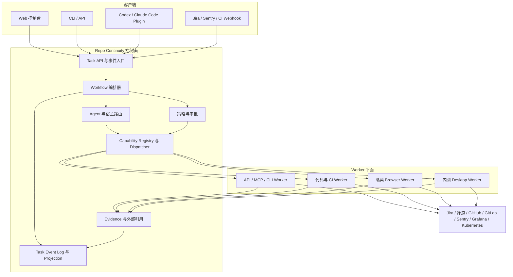

# Repo Continuity 控制面架构

**状态：** 已接受的产品方向，运行时尚未实现

**最后更新：** 2026-08-08

**范围：** 默认 `template/` payload 之外的可选编排与集成层

## 决策摘要

Repo Continuity 将演进为两个可以独立使用的层次：

1. **Repo Continuity Core** 继续是仓库自有的 Markdown 与 Git 知识层及轻量交付契约。它不依赖服务、数据库、调度器、隐藏记忆或自主运行时。
2. **Repo Continuity Control Plane** 是未来可选的运行时，负责跨平台任务状态、确定性 Workflow、策略、审批、审计和 Worker 调度。

Codex、Claude Code、其他 Coding Agent、自有 Web Agent 和自动化客户端，都是控制面周围可以替换的宿主或入口。任何一个宿主都不是长期项目事实的唯一所有者。Worker 通过受限 Capability 提供 Issue Tracker、代码托管、可观测性、CI/CD、Kubernetes、浏览器和桌面能力。

目标架构采用**混合模式**：

- 控制面持有长期任务生命周期和 Workflow 的下一条允许迁移；
- 宿主或自有 Agent 只在一个租约化步骤内负责有限推理；
- Worker 执行已经校验的 ActionRequest，不决定更大范围的 Workflow；
- 人在风险发生点审批高影响操作；
- 仓库知识以及 Tracked/Governed WORK 继续以 Git 中可 Review 的形式存在。

本文档不表示控制面运行时或连接器已经实现。

## 为什么需要独立的一层

软件交付会跨越具有不同信任、身份和执行边界的系统：

- Jira 或禅道可能拥有需求和缺陷；
- GitHub 或 GitLab 可能拥有 Code Review 和 CI 状态；
- Sentry 和 Grafana 可能拥有诊断证据；
- CI/CD 或 GitOps 系统可能拥有部署流程；
- Kubernetes 提供运行状态；
- 私有或旧系统可能只能从内网浏览器或桌面访问。

Coding Agent 会话可以协调一个有限任务，但不适合作为组织级长期 Workflow 的权威。会话会结束，宿主会变化，工具目录并不相同，而且模型生成的决定不是授权决定。控制面的价值，是跨越这些边界保存状态并强制执行必须确定化的交付规则。

## 产品边界

### 当前已经交付的 Core

Repo Continuity Core 负责：

- 仓库指令和链接式项目知识；
- Direct、Tracked 和 Governed 路由；
- 每个 Tracked/Governed 工作唯一且稳定的 WORK；
- Checkpoint、决策、风险、验证证据和下一步；
- 长期经验固化；
- Git 隔离和可恢复交接语义。

Core 不依赖控制面。安装、移除或替换控制面实现，都不能让仓库知识变得不可读，也不能破坏核心 Workflow。

### 可选控制面：已接受的设计方向

控制面负责：

- 从外部进入的任务身份和关联关系；
- 持久化 Workflow 状态、重试、超时、暂停、恢复和补偿；
- Capability 发现与调度；
- 策略判断和操作时审批；
- 身份引用和执行位置选择；
- 审计事件与外部证据引用；
- 在兼容宿主或 Worker 间切换而不丢失任务状态。

控制面只链接拥有生命周期的外部系统，不复制它们。Jira、禅道、GitHub、GitLab、CI/CD 和发布系统仍是其原生对象的权威来源。

### 非目标

组合后的产品不计划：

- 替代 Issue Tracker、代码托管、CI/CD、可观测平台或 Kubernetes；
- 把所有交付决定交给不受限制的模型自治；
- 在稳定 API 或 CLI 存在时强制使用浏览器或桌面自动化；
- 让 Codex、Claude Code 或某家模型厂商成为 Core 的强制依赖；
- 把开发者不受限制的日常浏览器 Profile 同步到云端 Worker；
- 在 WORK、Prompt、Action 日志或 Evidence 中保存凭据、Token 或 Secret；
- 在仓库 Workflow 文件中复制外部系统的完整生命周期。

## 术语

| 术语 | 职责 |
|---|---|
| Model | 产生推理、结构化建议或 Tool Call，本身不是权限来源。 |
| Agent Runtime | 运行模型与工具循环、组装上下文、判断结果，并在获准边界内决定下一步。 |
| Host Agent | Codex、Claude Code、其他 CLI Agent 或自有 Agent 会话，负责有限推理与工具使用。 |
| Client | 创建或观察任务的 Web UI、CLI、Plugin、聊天集成、Webhook 或 API 调用方。 |
| Skill | 宿主按需读取的可复用指令和领域流程知识，不是独立 Runtime。 |
| Control Plane / Hub | 持有长期任务状态、Workflow 迁移、策略、审批、调度和审计。 |
| Workflow | 定义必经阶段、门禁、失败处理和完成条件的确定性状态机。 |
| Capability | 可版本化、可被策略引用的操作，例如 `sentry.issue.search`。 |
| Worker | 在特定网络或机器边界内执行已校验 Capability 请求。 |
| Connector | Worker 使用的平台专属 API、SDK、CLI、MCP、浏览器或桌面实现。 |
| Evidence | 支持决策、验证或审计事件的不可变或内容寻址观察结果。 |

## 支持的运行模式

### 宿主主导模式

用户直接在 Codex、Claude Code 或其他宿主中工作。宿主持有当前推理循环，并调用 Repo Continuity Skill 和 Worker。仓库 Core 状态负责长期交接，可以完全没有 Hub。

该模式适用于个人开发者、早期试点和交互式仓库工作。实现成本最低，但最依赖宿主自身的会话、审批和工具行为。

### Hub 主导模式

自有服务同时持有持久 Workflow 和 Agent 循环。用户通过 Web UI、CLI、API 或 Webhook 使用。Coding Host 可以不存在，也可以作为专业 Worker。

该模式适合后台自动化、多用户队列、组织级策略和产品化服务。控制能力最强，同时需要最多的 Runtime 工程投入。

### 混合模式——目标模式

Hub 持有任务生命周期，把一个有限步骤委托给兼容宿主或自有 Agent。宿主返回 ActionProposal、执行结果、Evidence，或者用户输入/审批请求。Hub 再提交下一次 Workflow 迁移。

任何时刻只能有一个组件拥有下一次 Workflow 迁移权。Delegation Lease 需要标识当前步骤、允许的 Capability、过期时间和预期 Evidence。宿主不能静默把权限扩展到其他阶段或环境。

该模式可以利用成熟 Coding Host，同时避免把它们变成永久产品依赖。

## 参考架构



## 决策归属

| 决策 | 默认所有者 | 原因 |
|---|---|---|
| 理解用户目标并识别歧义 | Agent Runtime | 需要上下文推理。 |
| 选择下一条诊断查询或代码路径 | Agent Runtime | 属于探索性且依赖证据。 |
| 为请求选择具体 Capability 实现 | Capability Router | 依赖健康状态、网络、租户和执行位置。 |
| 决定必经阶段与完成条件 | Workflow 定义 | 必须保持确定、可 Review。 |
| 决定某个主体是否有权执行操作 | Policy Engine | 授权不能由模型推断。 |
| 批准高影响外部操作 | 授权用户或确定性策略 | 需要可追责的同意。 |
| 执行准确 API、浏览器、桌面或命令动作 | Worker | 在所需信任和网络边界内运行。 |
| 根据验收条件验证结果 | Workflow 与 Evaluator | 结合确定性检查和有限推理。 |
| 保存项目事实和可复用经验 | 仓库 Workflow | 必须跨宿主和 Runtime 可移植。 |

模型可以从当前步骤暴露的 Capability 中选择，但“可见”不代表“有权”。执行前必须再次进行策略判断。

## Capability 契约

Capability 使用稳定命名：

```text
<system>.<resource>.<verb>
```

例如：

- `jira.issue.read`
- `zentao.story.create`
- `github.pull_request.create`
- `gitlab.pipeline.read`
- `sentry.issue.search`
- `grafana.loki.query`
- `kubernetes.workload.read`
- `deployment.staging.promote`
- `browser.interact`
- `desktop.interact`

每个已注册 Capability 必须声明：

- 稳定 ID 与语义版本；
- 输入与输出 Schema；
- 效果类别：`read`、`propose`、`write` 或 `destructive`；
- 所需身份 Scope 和执行位置；
- 幂等与重试语义；
- 审批类别和策略属性；
- 超时与取消行为；
- 成功或失败产生的 Evidence；
- 健康和兼容性元数据。

通用 UI Capability 只是兜底。反复使用的业务动作应提升为 `zentao.bug.create` 这类狭窄 Capability，而不是一直暴露不受约束的 `browser.interact`。

### 通用 Envelope

逻辑协议与传输无关；MCP、HTTP、队列或本地进程都可以传递相同 Envelope。

```text
Task
  id
  objective
  source and requested_by
  repository and external references
  route: Direct | Tracked | Governed
  workflow and current_state
  policy_context
  correlation_id

ActionRequest
  task_id and step_id
  capability and version constraint
  arguments
  execution_target
  idempotency_key
  approval_reference when required
  evidence_requirements

ActionResult
  status and observed_at
  structured output
  external references
  evidence references
  retryable flag and normalized error
```

凭据只通过不透明引用传递，并且只在获准执行边界中解析，绝不能出现在这些 Envelope 中。

## 任务与 Workflow 状态

控制面维护 Append-only Event History，并由它生成当前 Projection。最小生命周期是：

```text
received
  -> classified
  -> planned
  -> executing
  -> waiting_input | waiting_approval | blocked
  -> executing
  -> verifying
  -> completed | failed | cancelled | rolled_back
```

每次状态迁移包含执行者、原因、Workflow 版本、相关 Action 和 Evidence 引用。重试复用稳定 Task ID，但产生新的 Attempt ID，不删除之前的 Evidence。

对仓库工作：

- Direct 工作仍不创建仓库 WORK；
- Tracked/Governed 工作只链接一个稳定 WORK；
- Hub 保存外部 Task 与 Action 事件，WORK 保存 Fresh Agent 恢复所需的仓库 Checkpoint；
- 两边都不复制 Jira、GitHub、GitLab、CI/CD 或发布系统拥有的完整生命周期。

## 参考 Workflow

### 从需求到交付

```text
intake
  -> 重复项与上下文搜索
  -> 需求草稿
  -> 人工确认
  -> 创建 Issue
  -> 仓库规划与实现
  -> 验证与 Review
  -> 创建 PR/MR
  -> 验收 Evidence
  -> 更新 Issue
```

模型可以起草和拆分需求；Workflow 控制确认、仓库隔离、验证和外部写入。

### 从事故到已验证修复

```text
告警或问题报告
  -> 只读获取 Sentry 与 Grafana Evidence
  -> 关联部署和代码
  -> 根因假设
  -> 创建或关联 Bug
  -> 隔离代码修复
  -> 测试与 Review
  -> 部署 Staging
  -> 部署后 Evidence
  -> 关闭或升级
```

诊断结果是 Evidence，不是修改生产环境的权限。

### 环境晋级

```text
发布请求
  -> 制品与来源检查
  -> 变更和回滚计划
  -> 环境策略门禁
  -> 按需审批
  -> CI/CD 或 GitOps 晋级
  -> Rollout 与健康验证
  -> 完成或补偿
```

生产访问通常应由 CI/CD 或 GitOps 中介。直接修改 Kubernetes 只能作为显式 Governed 例外。

## Worker 策略

按照下面顺序选择最狭窄且稳定的执行机制：

1. 有文档的 API 或 SDK；
2. 平台 CLI；
3. 对 API/CLI 的专用 MCP 封装；
4. 确定性浏览器自动化；
5. 模型引导的浏览器自动化；
6. 桌面自动化。

私有化部署不等于必须使用浏览器自动化。Worker 可以部署在私有平台旁边，封装其本地 API 或 CLI，不要求厂商提供 LLM 能力。

### Worker 类型

- **Platform Worker：** Issue Tracker、代码托管、可观测、CI/CD 和 Kubernetes API。
- **Code Worker：** 仓库 Checkout、Worktree、编辑、测试、Review 和 Patch；可以使用 Codex、Claude Code、其他 Coding Agent 或自有 Runtime。
- **Browser Worker：** 隔离浏览器或 VM，具有域名和 Action Allowlist、专用身份和会话 Evidence。
- **Desktop Worker：** 处理 Thick Client、硬件身份认证或已有本地机器状态的本地/内网执行器，是最后兜底。

Worker 可以运行在云端、私网或本地。内网 Worker 通常应主动建立经过身份认证的出站通道，而不是让控制面入站访问私网。

## 部署拓扑

### 开发者本地试点

- 没有 Hub，或者只有单用户本地 Hub；
- Codex、Claude Code 或其他宿主持有有限推理；
- 使用本地 API 和 Browser Worker；
- 仓库 WORK 提供长期交接。

### 私有化部署

- Hub、数据库、Evidence Store 和 Worker 都运行在组织网络中；
- 身份集成组织 Identity Provider 和 Secret Manager；
- Worker 使用按项目和环境划分 Scope 的 Service Account；
- 是否访问云模型独立治理。

### 混合部署

- 托管 Hub 保存 Task 状态和策略元数据；
- 私网或本地 Worker 通过双向认证的出站通道拉取获准任务；
- Secret 和高权限 Session 留在私有执行边界；
- 只有最小化结果和获准 Evidence 离开该边界。

纯云端部署无法在没有边界内执行器的情况下控制用户现有桌面，也无法访问完全隔离的私有系统。

## 安全与信任不变量

- 分离 `read`、`propose`、`write` 和 `destructive` Capability 类别；
- 身份按 Tenant、项目、仓库和环境划分 Scope；
- 凭据只在需要它的 Worker 内解析；
- 生产、破坏性、权限、Secret 和难回退操作需要操作时审批；
- 把 Issue 文本、源码评论、日志、网页、截图和 Tool Output 当作不可信输入，而不是授权；
- 浏览器和桌面自动化运行在具有域名、文件、网络和 Action Allowlist 的隔离环境；
- 优先使用专用自动化身份，不使用开发者无限制的日常 Profile；
- 执行前立即校验 Action 参数、授权、幂等键和 Workflow Lease；
- 每个外部写入和 Governed 决策都保存防篡改审计事件与 Evidence 引用；
- 在模型上下文、日志、截图和 Evidence 离开执行边界前清理 Secret 和敏感 Payload；
- 每个 Capability 明确定义取消、超时、重试和补偿；
- Tool Call 成功不等于任务完成，Workflow 必须验证实际外部状态。

## 仓库放置规则

该架构保留当前分发契约：

- `template/` 继续是无工具依赖的 canonical 下游 Core，不增加 Runtime 依赖；
- `skills/repo-continuity/` 继续提供可选自动化和宿主指导，不成为任务状态的隐藏所有者；
- `adapters/` 只保存显式启用的厂商专属宿主 Overlay；
- `docs/` 保存产品架构、实现决策和维护者指南。

开始实现 Runtime 时，应优先采用可独立部署的边界。可能的 Monorepo 结构是：

```text
packages/protocol/       与传输无关的 Schema 和 Capability 契约
services/hub/            Task、Workflow、Policy、Approval、Dispatch、Audit
workers/                 Platform、Code、Browser、Desktop Executor
clients/                 Web、CLI、Codex、Claude Code、Webhook Adapter
```

该布局仅用于说明，不授权创建空脚手架。第一个实现切片只创建实际使用的 Package。

## 交付路线图和门禁

### Phase 0——设计基线

- 接受双层产品定位；
- 定义职责边界和 Capability 契约；
- 明确区分 Runtime 方向与已经交付的 Core 能力。

退出门禁：架构可 Review，并且中英文指南都能进入该文档。

### Phase 1——宿主优先的垂直切片

- 定义有版本的 Task、Action、Result、Evidence 和 Approval Schema；
- 使用 Codex、Claude Code 或其他兼容宿主持有推理循环；
- 实现一个 Issue Tracker Adapter、一个 Source Host Adapter 和只读 Observability Adapter；
- 在不让 Hub 成为 Core 强制依赖的前提下保存关联与 Evidence；
- 不加入浏览器自动化和生产写入。

退出门禁：一项事故或需求可以从 Intake 进入 Draft Issue 或 PR，具有可复现 Evidence，并且协议中没有宿主专属数据。

### Phase 2——持久 Hub 与审批

- 增加 Task Event Store 和 Workflow 编排；
- 增加 Web/API Task 创建、观察、输入和审批；
- 增加 Worker Registry、Lease、幂等、重试和取消；
- 支持在步骤之间切换兼容宿主。

退出门禁：宿主终止后，任务可以根据 Hub 和仓库状态恢复，不重复已经成功的外部写入。

### Phase 3——Staging 交付

- 增加 CI/CD 或 GitOps 到非生产环境的晋级；
- 验证 Rollout、健康、日志和验收 Evidence；
- 实现补偿和回滚路径。

退出门禁：Staging 晋级可治理、可重复、可观察、可恢复。

### Phase 4——浏览器兼容 Worker

- 增加隔离的确定性 Browser Worker；
- 只在不支持的 UI 片段使用模型引导交互；
- 把重复 UI 流程提升为狭窄 Capability；
- 保存已经清理的会话 Evidence，并要求操作时审批。

退出门禁：纯 UI Workflow 无法超越域名、身份、Action 或环境策略。

### Phase 5——只有证据支持时才增加 Desktop Worker

- 只处理 API 与 Browser Worker 无法覆盖的 Thick Client、本地状态、硬件认证或私有桌面 Workflow；
- 优先要求专用机器或 VDI，再考虑开发者日常桌面；
- Worker 始终可选并且可以在本地撤销。

退出门禁：有文档化用例证明 API、CLI 和浏览器方案都不充分。

## 第一个 Runtime 切片的验收条件

只有满足以下条件，第一个 Runtime 切片才可接受：

- 同一 Task 可以从宿主 Plugin 或 API 发起，而不改变领域 Schema；
- Task、Action、Attempt、Approval 和 Evidence 都有稳定 ID；
- 只暴露当前步骤相关的 Capability；
- 每个写操作都在 Dispatch 前立即执行策略检查；
- 重复投递 Action 不会重复已经成功的外部效果；
- Result 包含外部引用和验证 Evidence；
- Tracked/Governed 仓库工作只链接一个 WORK；
- 替换宿主或模型不会改变 Workflow 或 Capability 契约；
- 移除可选 Runtime 后 Repo Continuity Core 仍完整可用。

## Runtime 实现前仍需决策的问题

以下选择有意保持未决，需要证据或单独接受的决策：

- Workflow Engine 和 Event Store 技术；
- 第一个部署采用单租户还是多租户；
- Identity Provider、Secret Manager 和凭据委托方式；
- 第一条垂直切片使用的参考 Issue Tracker、Source Host 和 Observability Stack；
- Hub 与 Worker 位于当前仓库还是独立版本仓库；
- 协议实现语言和 SDK 生成策略；
- Evidence 保留、加密、脱敏与删除策略；
- 每个宿主的 Plugin 分发和兼容承诺；
- 托管服务的运营和 License 模式。

任何实现选择都不能削弱 Core 的保证：只使用 Markdown 和 Git，也能理解和恢复仓库工作。
